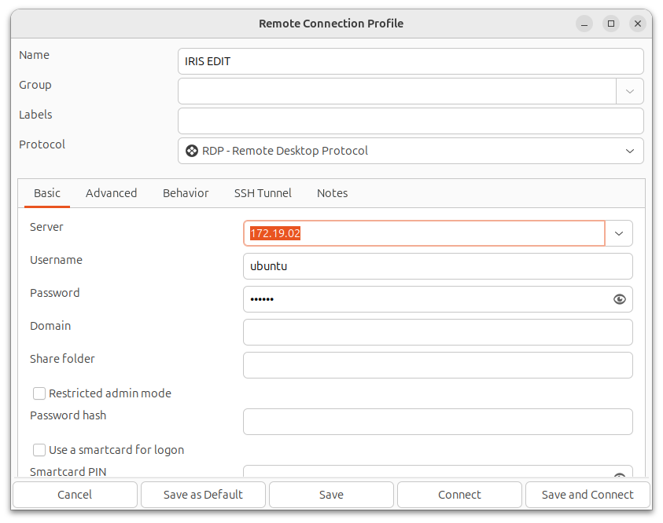

# IRIS_Editor_IP_Safe
A Docker appliance pre-installed with VSCode and IRIS Editor plugins without external AI connectivity.

# Rationale
I need an IRIS code editor on Ubuntu:
1. Isolated from internet
2. Work with IRIS on other docker containers on same host
3. No internet connected AI
4. Pre-installed
5. Pre-configured

# Pre-requisites
RDP client. With ubuntu remmina RDP client is likely already installed:

```bash
whereis remmina
```

Grab the docker code and support files.
Build the docker image
```
git clone --depth 1 https://github.com/alexatwoodhead/IRIS_Editor_IP_Safe.git
cd IRIS_Editor_IP_Safe
docker build -t iris_edit .
```

# Bash alias
Context: Host
Add following to host file: ~/.bash_aliases
```
d_iris_edit() {
  if [ $1 == 'run' ]; then
    if [ `docker ps | grep -q "iris_edit"` ] ; then
      echo "docker already running"
    else
      echo "starting docker iris_edit"
      docker run -d -it --rm --name iris_edit --memory=8g --network no-internet --gpus "device=0" -p 3390 iris_edit /bin/bash -c "while true; do sleep 10; done"
      docker exec -it -u root iris_edit /usr/bin/bash -c "echo \"ubuntu:ubuntu\" | chpasswd"
      docker exec -i -u ubuntu iris_edit /usr/bin/bash -c "echo 'PS1=\"\\[\\033[01;31m\\]\\u@iris_edit\\[\\033[00m\\]:\\[\\033[01;34m\\]\\w\\[\\033[00m\\] \$ \"\' >> ~/.bashrc"
    fi
    dipaddr=$(docker exec -it iris_edit /usr/bin/bash -c "ip addr | grep \"172.19\" | cut -d \" \" -f 6 | cut -d \"/\" -f 1")
    # Launch default web browser to page
    echo "iris_edit was launched on $dipaddr"
  elif [ $1 == 'exec' ]; then
    docker exec -it -u ubuntu iris_edit /usr/bin/bash
    return
  elif [ $1 == 'stop' ]; then
	docker stop iris_edit
  fi
}
```

# Update open host terminal (if needed)
```
source ~/.bash_aliases
```
# Start IRIS Editor appliance
Context: Host terminal
```bash
d_iris_edit run
```
Note:
When the iris edit appliance starts it prints the IP address that it is using to the terminal.
This is useful for confirming the expected IP for RDP client to connect to.
```output
starting docker iris_edit
9c3ed76f76d850bf97844ef4354cf01b258ef3ce8f53d1adce34b1ba538cd487
iris_edit was launched on 172.19.0.2
```
The alias command demonstrates the following run options:

| flag      | value       | comment                                                                                                       |
| --------- | ----------- | ------------------------------------------------------------------------------------------------------------- |
| --memory  | 8g          | It doesn't need to be this much but probably over 1gb                                                         |
| --network | no-internet | This is kind of the point of the appliance. It can't connect to external AI, logging or code parsing services |
| --gpus    | "device=0"  | Editor may need hardware acceleration                                                                         |

The default credential get set to ubuntu:ubuntu when the IRIS editor docker appliance is started.
Feel free to modify the alias script to employ different values or mechanism to update the default account.
# IRIS Editor Terminal session ( direct )
Context: Host terminal
```bash
d_iris_edit exec
```
Note:
When entering direct terminal sessions from host by default the docker would give a white terminal prompt with username and a generated alphanumeric for host name. For example:

```output
irisowner@ee716d36a343:~$ whereami
```
This creates context risk with the host and or confusion with manging other docker container terminal.
Therefore the alias script helps you by changing the remote terminal prompt to:
* Red text for user and hostname
* Useful Host name = iris_edit
* Current directory locaton
For example:


# Stop IRIS Editor
Context: Host terminal
```bash
d_iris_edit stop
```
The container is removed and deleted after use. That a feature for how a new container was provisioned in the alias run command.

# RDP to IRIS Editor
With the iris_editor appliance running.
Now launch the RDP editor:
```bash
remmina
```

# A Quick RDP configuration
Create a quick connection configuration.
Ensure the IP address is the same that was printed out when the appliance was started ( "d_iris_edit run" ).
Appliance uses the standard RDP port.
The default password is "ubuntu" unless modified in the d_iris_edit alias command.



After RDP logon, should be presented with a desktop with "IRIS Editor" shortcut.


Double click on this to start vscode with plugins.

After launching the editor. Click on the InterSystems logo plugin and expand servers.
By default the appliance has two connections (172.19.0.3 ) and (172.19.0.4).


Timesaver:
Note: When an IRIS appliance first runs it has default credentails password.
Login to the System Management Portal direclty from the host to change the default logon BEFORE connecting IRIS Editor to the IRIS service. http://172.19.0.3:52773/iris/csp/sys/UtilHome.csp


So continuing, using RDP session withg IRIS Editor connecting to another docker conatiner at 172.19.0.3 ( started after iris_edit appliance ).
If you right click on of these servers and 'edit', the settings file is opened.


These connection settings come with the docker image. If you had other standard settings then you could substitute the settings file for the docker build. Alternatively copy different settings configuration when running the "iris_edit run" bash aliases.
The configuration as pre-loaded in the docker image.


An example of iris running in a second docker appliance connected to from the iris_edit appliance.
RDP with Editor and looking at some code in the User namespace.


# Editor Bash start
The IRIS Editor is also able to be started from a bash terminal in within the remote desktop.
The utility of doing this is:
1. Understand limitations and warnings in this configuration
2. Confirm unwanted external connectivty is not occuring.

There is a terminal start shortcut off bottom RDP toolbar


Example of IRIS Editor launch with some 'not connecting' messages:


# Limitations
Webpages do not play well viewed within the Editor. Recommend open system management portal directly from host web browser to the IRIS appliance. For example: http://172.19.0.3:52773/iris/csp/sys/UtilHome.csp


